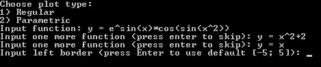
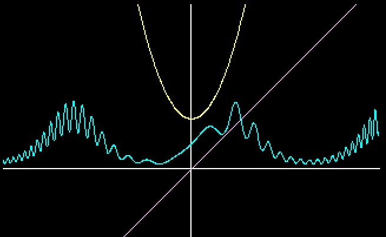
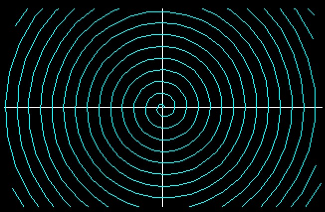

# Plotter

Проект для Mini Bleenchiki.\
\
Программа под DOS для построения графиков функций.\
Поддерживаются 2 типа графиков:
- Обычный - функция вида $y=f(x)$
- Параметрический - функция, заданная системой уравнений\
$x=x(t),$\
$y=y(t)$

\
В проекте был вручную реализован алгоритм Брезенхема для рисования линий.\
Разбор математических выражений выполнен с помощью обратной польской записи.

\

\

\

